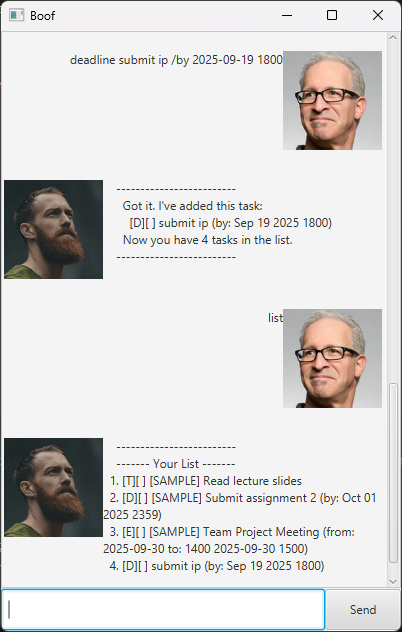

# Boof User Guide



Boof is a simple and intuitive task manager for managing todos, deadlines, and events. It supports marking tasks as done, searching, deleting, and more—all via a clean GUI and command-line interface.

## Feature: Add Todos

// Feature details
Add a simple todo task to your list.

Example: `todo Read lecture slides`

Expected outcome:
```
Added: [T][ ] Read lecture slides
```

## Feature: Add Deadlines

You can add a deadline task to keep track of tasks that must be completed by a specific date and time.

Example: `deadline Submit assignment /by 2025-10-01 2359`

This will add a new deadline task to your list with the specified description and due date.

```
Added: [D][ ] Submit assignment (by: 2025-10-01 2359)
```


## Feature: Add Events

Add an event task with a start and end time.

Example: `event Team Project Meeting /from 2025-09-30 1400 /to 2025-09-30 1500`

Expected outcome:
```
Added: [E][ ] Team Project Meeting (from: 2025-09-30 1400 to: 2025-09-30 1500)
```

## Feature: Mark/Unmark Tasks

Mark a task as done or not done.

Example: `mark 2`

Expected outcome:
```
Nice! I've marked this task as done:
  [D][X] Submit assignment (by: 2025-10-01 2359)
```

Example: `unmark 2`

Expected outcome:
```
OK, I've marked this task as not done yet:
  [D][ ] Submit assignment (by: 2025-10-01 2359)
```

## Feature: Delete Tasks

Delete a task from your list.

Example: `delete 3`

Expected outcome:
```
Noted. I've removed this task:
  [E][ ] Team Project Meeting (from: 2025-09-30 1400 to: 2025-09-30 1500)
```

## Feature: Find Tasks

Find tasks containing a keyword.

Example: `find assignment`

Expected outcome:
```
Here are the matching tasks in your list:
  [D][X] Submit assignment (by: 2025-10-01 2359)
```

## Feature: List Tasks

Display all tasks in your list.

Example: `list`

Expected outcome:
```
Here are the tasks in your list:
  1. [T][ ] Read lecture slides
  2. [D][X] Submit assignment (by: 2025-10-01 2359)
  3. [E][ ] Team Project Meeting (from: 2025-09-30 1400 to: 2025-09-30 1500)
```

## Feature: Help

Show all available commands.

Example: `help`

Expected outcome:
```
Here are the available commands:
1. list - Displays all tasks.
2. todo <description> - Adds a todo task.
3. deadline <description> /by <date/time> - Adds a deadline task.
4. event <description> /from <start date/time> /to <end date/time> - Adds an event task.
5. mark <task number> - Marks a task as done.
6. unmark <task number> - Marks a task as not done.
7. delete <task number> - Deletes a task.
8. find <keyword> - Finds tasks containing the keyword.
9. bye - Exits the application.
10. help - Displays this help message.
```
